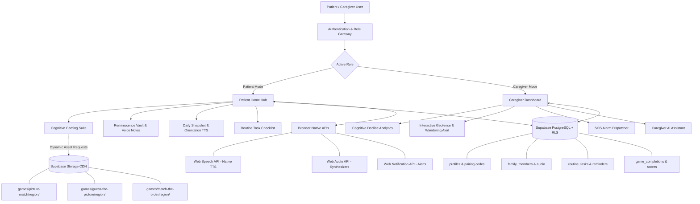

# 🌸 SANJIVNI
### AI-Powered Cognitive Gaming, Cultural Reminiscence & Caregiver Telemetry Platform for Elderly Dementia Patients in the North Eastern Region (NER)

**Smart India Hackathon (SIH) Problem Statement ID:** `SIH26003`

---

[](https://vitejs.dev/)
[](https://react.dev/)
[](https://www.typescriptlang.org/)
[](https://tailwindcss.com/)
[](https://supabase.com/)
[](https://www.w3.org/WAI/standards-guidelines/wcag/)
[](https://opensource.org/licenses/MIT)

---

## 📌 Overview & Mission

Dementia and age-related neurodegenerative decline pose acute healthcare challenges across India. In the **North Eastern Region (NER)**, geographic dispersion, linguistic diversity, and a shortage of geriatric health facilities exacerbate these difficulties. Mainstream digital cognitive solutions rely heavily on Western cultural concepts and English-only interfaces, creating emotional alienation and high attrition among elderly Indian patients.

**SANJIVNI** is an elder-first, culturally localized progressive web application (PWA) designed to:
1. **Retard Cognitive Decline:** Through culturally anchored, scientifically designed neuro-cognitive exercises.
2. **Preserve Autobiographical Memory:** Through digital reminiscence therapy with family kinship cards, familiar audio voice notes, and daily reality-orientation snapshots.
3. **Foster Daily Autonomy:** Through sensory-friendly routine reminders and medication checklists.
4. **Empower Caregivers:** Through real-time wander monitoring, interactive geofencing, emergency SOS broadcasts, and an AI clinical assistant.

Inspired by Duolingo's friendly gamification and tactile design, SANJIVNI features **chunky 3D tap targets ($\ge 56\text{px}$)**, **native Web Speech synthesis at an elderly-friendly pace ($0.88\times$)**, **Web Audio synthesizers**, and **dynamic Supabase CDN asset streaming** across all 8 North-Eastern states.

---

## 🌟 Core Feature Modules

### 1. 🧠 Culturally Anchored Cognitive Gaming Suite
Cognitive stimulation based on indigenous landmarks, fauna, crafts, and festivals rather than generic abstract concepts:
- **Picture Matching Game (`picture-match`):** 3D card-flipping memory match pairing authentic regional photos (e.g., Kaziranga Rhino, Majuli Island, Living Root Bridge, Tawang Monastery).
- **Match the Order Game (`match-the-order`):** Multi-level sequential recall testing working memory with visual flash sequences and sound effects.
- **Guess the Picture Game (`guess-the-picture`):** Photographic trivia quiz presenting massive tap options, immediate positive reinforcement, and cultural fun facts.
- **Dynamic Supabase CDN Routing:** Assets are dynamically routed from the public `media` storage bucket based on the patient's active region: `games/[game-folder]/[region-folder]/[filename]`.
- **Fault-Tolerant Asset Loading:** In-flight image error boundaries (`onError`) automatically catch 404s and render high-contrast local fallbacks without breaking the game loop.

### 2. 🏡 Reminiscence Therapy Vault
- **Kinship Flashcards:** High-contrast relationship cards displaying family roles (e.g., Grandson, Daughter, Spouse) with recorded voice introductions from relatives.
- **Familiar Audio Therapy:** One-tap audio playback designed to soothe patients during episodes of agitation, "sundowning", or memory confusion.
- **Daily Orientation Snapshot:** Real-time date, time, weather, and day/night cycle dynamically presented in native script with 1-tap Text-to-Speech (TTS).

### 3. 🌐 Deep 6-Language Regional Localization
Zero English leakage—every UI element, date string, weather condition, and instruction dynamically responds to the chosen language:
| Language | Native Script | Target Regions | Flag / Emblem |
| :--- | :--- | :--- | :---: |
| **English** | English | All NER (Default) | 🌐 |
| **Assamese** | অসমীয়া | Assam / NER Core | 🦏 |
| **Hindi** | हिन्दी | National / NER Transit | 🇮🇳 |
| **Bengali** | বাংলা | Tripura / Assam Valley | 🌸 |
| **Manipuri** | মৈতৈলোন্ (Meitei) | Manipur | 🦌 |
| **Mizo** | Mizo ṭawng | Mizoram | ⛰️ |

### 4. 🛡️ Caregiver Portal & Safety Telemetry
- **6-Digit Pairing Protocol:** Secure cryptographic connection code pairing the patient device with the caregiver dashboard.
- **Safety PIN Lock Modal:** Prevents dementia patients from accidentally editing medication schedules or altering settings.
- **Interactive Geofencing Map:** Visualizes home safety perimeters and simulates wandering behavior with instant visual status indicators.
- **Emergency SOS System:** Native Web Audio synthesizer siren with visual emergency broadcasting.
- **Caregiver AI Chatbot Assistant:** Context-aware virtual assistant summarizing cognitive scores, task completion rates, and personalized care guidance.
- **Device-Level Push Notifications:** Native browser alerts (`Notification` API) scheduled for time-critical routines.

### 5. ♿ Elder-First Accessibility (WCAG AAA)
- **Massive Tap Targets:** Minimum touch target height of $56\text{px}$ to accommodate tremors and reduced motor precision.
- **Paced Text-to-Speech:** Accessible Web Speech read-aloud buttons available on all headlines, instructions, and cards.
- **High-Contrast Dark & Light Modes:** Tested against WCAG AAA contrast ratios with zero muted or unreadable text.
- **Interactive Spotlight Tour:** Step-by-step guided onboarding with mascot coach marks.

---

## 🏗️ System Architecture



---

## 🛠️ Technology Stack

| Layer | Technology | Purpose |
| :--- | :--- | :--- |
| **Frontend Framework** | React 18.3 (Vite 6) | Ultra-fast declarative reactive UI with HMR |
| **Language** | TypeScript 5.7 | Strict type safety across game state, models, and APIs |
| **Styling & Design** | Tailwind CSS 3.4 | Tactile 3D Duolingo-style utilities, dark mode, responsive grid |
| **Backend & Database** | Supabase (PostgreSQL 15) | Relational data persistence with strict Row-Level Security (RLS) |
| **Cloud Storage** | Supabase Storage CDN | Public `media` bucket for regional photographic asset delivery |
| **Authentication** | Supabase Auth | Google OAuth + Offline-tolerant Demo Session provider |
| **Audio Synthesizer** | Web Audio API (`AudioContext`) | Zero-latency celebratory chimes and emergency sirens |
| **Speech Engine** | Web Speech API (`SpeechSynthesis`) | Native regional text-to-speech without external API fees |
| **Icons & Visuals** | Lucide React + Canvas Confetti | Clean, lightweight elder-friendly iconography and celebration bursts |

---

## 📁 Repository Structure

```
sanjivni/
├── .env.example               # Environment variables template
├── docs/                      # Architectural and PRD documentation
│   ├── Architecture.md
│   ├── Implementation.md
│   └── PRD.md
├── design-system/             # Design tokens and accessibility guidelines
│   └── MASTER.md
├── public/                    # Static PWA manifests and icons
│   ├── assets/images/         # Local fallback cultural image sets
│   ├── manifest.json          # Web app manifest
│   └── vite.svg               # Local fallback image icon
├── src/
│   ├── components/
│   │   ├── auth/              # Login, Role Selection, PIN Lock, Pairing Modals
│   │   ├── caregiver/         # Dashboard, Geofencing Map, SOS Modal, Chatbot
│   │   ├── common/            # Header, BottomNav, Mascot, SpotlightTour, SpeechButton
│   │   └── patient/
│   │       ├── games/         # PictureMatching, MatchTheOrder, GuessThePicture, GamesHub
│   │       ├── reminiscence/  # DailySnapshot, FamilyVault, FamilyCard
│   │       └── routine/       # RoutineTimeline, RoutineItem
│   ├── context/
│   │   ├── AppContext.tsx     # Global reactive application state
│   │   └── AuthContext.tsx    # Supabase authentication and user profile state
│   ├── lib/
│   │   └── supabase.ts        # Supabase client singleton
│   ├── utils/
│   │   ├── assetManager.ts    # Supabase Storage CDN URL resolver & region normalizer
│   │   ├── audio.ts           # Web Audio API chime and siren synthesizers
│   │   ├── i18n.ts            # 6-language dictionaries
│   │   ├── locationWeather.ts # Localized weather and orientation utilities
│   │   ├── nerData.ts         # North-Eastern state cultural data
│   │   ├── notifications.ts   # Device push notification dispatcher
│   │   └── speech.ts          # Web Speech API helper
│   ├── App.tsx                # Main view router & accessibility listeners
│   ├── index.css              # 3D button depths, design tokens, animations
│   ├── main.tsx               # React DOM root mounting
│   └── vite-env.d.ts          # Vite environment types
├── supabase/
│   └── schema.sql             # Complete PostgreSQL schema, tables, indexes & RLS policies
├── package.json               # Node.js dependencies and scripts
├── tailwind.config.js         # Tailwind configuration
├── tsconfig.json              # TypeScript compiler configuration
└── vite.config.ts             # Vite bundler configuration
```

---

## 🚀 Quick Start Guide

### Prerequisites
- **Node.js:** `v18.0.0` or higher
- **npm:** `v9.0.0` or higher
- A free [Supabase](https://supabase.com/) project (optional for full cloud sync; app includes offline demo mode)

### 1. Clone & Install
```bash
# Clone repository
git clone https://github.com/your-username/sanjivni.git

# Enter project directory
cd sanjivni

# Install dependencies
npm install
```

### 2. Configure Environment Variables
Copy `.env.example` to `.env`:
```bash
cp .env.example .env
```
Edit `.env` with your Supabase credentials:
```env
VITE_SUPABASE_URL=https://your-supabase-id.supabase.co
VITE_SUPABASE_ANON_KEY=your-supabase-anon-key
```

### 3. Database & Storage Setup (Supabase)
1. Navigate to **SQL Editor** in your Supabase Dashboard.
2. Open [`supabase/schema.sql`](file:///c:/Users/ragha/OneDrive/Desktop/projects/Sanjivni%20SIH%20project/supabase/schema.sql) and execute the script to create tables, indexes, and RLS policies.
3. In **Storage**, create a public bucket named `media`.
4. Create the folder hierarchy:
   ```
   media/
   └── games/
       ├── picture-match/
       │   ├── arunachal-pradesh/
       │   ├── assam/
       │   ├── manipur/
       │   └── meghalaya/
       ├── guess-the-picture/
       └── match-the-order/
   ```

### 4. Run Locally
```bash
npm run dev
```
Open your browser at `http://localhost:5173`.

### 5. Build for Production
```bash
npm run build
```
Verify the production build locally:
```bash
npm run preview
```

---

## 🔒 Security & Privacy

- **Row-Level Security (RLS):** All patient records, family profiles, routine tasks, and game histories are strictly guarded by PostgreSQL RLS policies tied to authenticated `auth.uid()`.
- **PIN-Protected Caregiver Mode:** Caregiver dashboards, medication modifications, and pairing codes require a 4-digit security PIN.
- **Zero Audio Eavesdropping:** All Text-to-Speech runs on-device using the browser's native `SpeechSynthesis` engine without sending patient audio to third-party servers.

---

## 👥 Contributors & Acknowledgments

- **Team:** SANJIVNI Development Team
- **Competition:** Smart India Hackathon (SIH)
- **Problem Statement ID:** `SIH26003` (AI-based cognitive gaming and memory assistance platform for dementia patients in NER)
- **Cultural Research:** Department of Health & Family Welfare, North Eastern Council (NEC) cultural references, and local geriatric practitioners.

---

## 📄 License

This project is licensed under the **MIT License** — see the [LICENSE](LICENSE) file for details.
